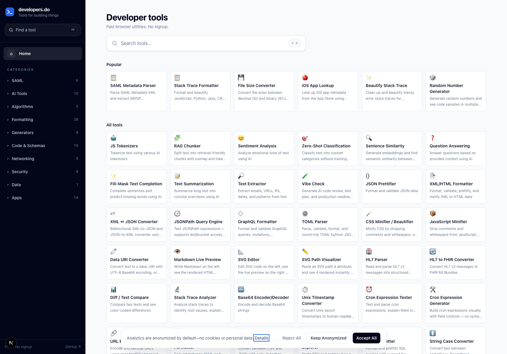

<p align="center">
  
</p>

# DevTools

A collection of 100+ essential developer tools built with privacy in mind.
No backend. Tool data never leaves your browser. Anonymized analytics help improve the site.



## Tools

### SAML
*   **SAML Decoder:** Decode SAML Requests/Responses from Base64 to readable XML
*   **SAML Metadata Parser:** Parse SAML Metadata XML and extract IdP/SP configuration
*   **SAML Certificate Inspector:** Inspect X.509 certificates from SAML metadata, responses, or PEM
*   **SAML Assertion Builder:** Generate test SAML Responses, AuthnRequests, and LogoutRequests
*   **SAML Metadata Generator:** Generate SAML 2.0 EntityDescriptor metadata XML for SPs and IdPs
*   **SAML Response Validator:** Debug a SAML Response and find out why SSO login is failing

### AI Tools
*   **JS Tokenizers:** Tokenize text using various AI tokenizers
*   **RAG Chunker:** Split text into retrieval-friendly chunks with overlap and token counts
*   **Sentiment Analysis:** Analyze emotional tone of text using AI
*   **Zero-Shot Classification:** Classify text into custom categories without training using AI
*   **Sentence Similarity:** Generate embeddings and find semantic similarity between texts using AI
*   **Question Answering:** Answer questions based on provided context using AI
*   **Fill-Mask Text Completion:** Complete sentences and predict missing words using AI
*   **Text Summarization:** Summarize long text into concise overviews using AI
*   **Text Extractor:** Extract emails, URLs, IPs, dates, and patterns from text
*   **Vibe Check:** Generate AI code review, test plan, and production readiness prompts for vibe-coded apps

### Algorithms
*   **String Similarity:** Compare strings using Jaro-Winkler, Levenshtein, Dice, and Hamming algorithms
*   **Regex Tester:** Test regular expressions with match highlighting, capture groups, and string replacement
*   **Regex Library:** Browse and copy common regular expressions for validation, extraction, and text processing
*   **Number Base Converter:** Convert numbers between binary, octal, decimal, and hex with two's complement
*   **SemVer Comparator:** Compare, sort, and validate semantic version strings per SemVer 2.0.0 with prerelease and build metadata support

### Formatting
*   **JSON Prettifier:** Format and validate JSON data
*   **XML/HTML Formatter:** Format, validate, prettify, and minify XML or HTML data
*   **XML ↔ JSON Converter:** Bidirectional XML-to-JSON and JSON-to-XML converter using the familiar @attr / _text convention; repeated tags collapse into arrays
*   **JSONPath Query Engine:** Test JSONPath expressions — supports dot/bracket access, wildcards, slices, recursive descent (..), and filter [?(...)] expressions
*   **GraphQL Formatter:** Format and validate GraphQL queries, mutations, subscriptions, and fragments — preserves string literals, args, blocks, lists, and comments
*   **TOML Parser:** Parse, validate, format, and round-trip TOML to/from JSON — spec-compliant via smol-toml
*   **CSS Minifier / Beautifier:** Minify CSS by stripping comments and whitespace, or beautify minified CSS with re-indentation — preserves spaces inside parentheses for values like rgba() and calc()
*   **JavaScript Minifier:** Strip comments and whitespace from JavaScript while preserving strings, template literals, and regex syntax — no AST, no variable renaming, just fast cosmetic minification
*   **Data URI Converter:** Convert text to a data: URI with UTF-8 Base64 encoding, or decode a data: URI back to text or binary bytes — handles any MIME type
*   **Markdown Live Preview:** Write Markdown on the left, see the rendered HTML preview on the right — supports headings, bold, italic, code, lists, quotes, links, autolinks, and GFM strikethrough
*   **SVG Editor:** Edit SVG code on the left, see the live preview on the right — strips scripts and event handlers for safety, adjusts missing xmlns
*   **SVG Path Visualizer:** Paste an SVG path d attribute and see it rendered instantly — includes presets (curve, star, arc, bezier), adjustable stroke/fill colors, and an optional grid overlay
*   **HL7 Parser:** Read and parse HL7 v2 messages into structured JSON
*   **HL7 to FHIR Converter:** Convert HL7 v2 messages to FHIR R4 Bundles
*   **Diff / Text Compare:** Compare two texts and see color-coded differences
*   **Stack Trace Formatter:** Format and beautify JavaScript, Python, Java, C#, Go, PHP, and Ruby stack traces
*   **Beautify Stack Trace:** Clean up and beautify messy error stack traces for readability
*   **Stack Trace Analyzer:** Analyze stack traces to identify root causes, explain errors, and separate app from framework code
*   **Base64 Encoder/Decoder:** Encode and decode Base64 strings
*   **File Size Converter:** Convert file sizes between decimal (SI) and binary (IEC) units
*   **Unix Timestamp Converter:** Convert Unix epoch timestamps to human-readable dates — single or batch — with timezone support
*   **Cron Expression Tester:** Test and parse cron expressions, explain them in plain English, and preview upcoming run times across timezones
*   **Cron Expression Generator:** Build cron expressions visually with field controls — no syntax knowledge required
*   **URL Encoder / Decoder:** Encode and decode URLs using encodeURIComponent and encodeURI
*   **YAML/JSON Converter & Formatter:** Convert between YAML and JSON, or format and validate standalone YAML
*   **CSV ↔ JSON Converter:** Convert between CSV and JSON with auto-detection, delimiter handling, type inference, and nested-object flattening
*   **CSV Viewer / Table Explorer:** Paste CSV and explore it as a sortable, searchable table with sticky headers — no spreadsheet required
*   **SQL Formatter:** Format and prettify SQL queries with support for MySQL, PostgreSQL, SQLite, and more
*   **String Case Converter:** Convert text between camelCase, PascalCase, snake_case, kebab-case, CONSTANT_CASE, dot.case, path/case, title, and sentence case
*   **Text Statistics:** Live word, character, sentence, line, and paragraph counts with reading time and average length stats
*   **Line Sorter & Deduplicator:** Sort lines alphabetically, numerically, by length, with optional deduplication and trimming
*   **String Escape / Unescape:** Escape and unescape text for JSON, XML, CSV, regex, or POSIX shell contexts
*   **Whitespace Visualizer & Cleaner:** Spot invisible whitespace characters (tabs, NBSP, zero-width, trailing) and clean them with batch options
*   **HTML Entity Encoder / Decoder:** Encode text to HTML entities (named, decimal, hex) and decode entities back to characters
*   **Unicode Escape / Unescape:** Convert text to \uXXXX and \u{XXXXX} Unicode escapes and back — handles emoji and surrogate pairs
*   **Morse Code Translator:** Convert text to ITU-R M.1677-1 Morse code and back — supports letters, digits, common punctuation, and word breaks

### Generators
*   **Password Generator:** Generate secure random passwords
*   **UUID Generator:** Generate UUIDs across all RFC 9562 versions — nil, v1, v2, v3, v4, v5, v6, v7, and v8
*   **Lorem Ipsum Generator:** Generate placeholder text for designs
*   **Random Number Generator:** Generate random numbers and see code samples in multiple languages
*   **QR Code Generator:** Generate QR codes from text, URLs, or any data
*   **ULID Generator:** Generate ULIDs — 26-character lexicographically sortable identifiers (48-bit timestamp + 80-bit random) with optional monotonic mode
*   **Git Branch Name Generator:** Convert a feature description into a clean, git-safe branch name with optional prefix (feat, fix, chore, etc.) and ticket id. Includes copy-paste checkout and push commands
*   **ASCII Art Text Generator:** Convert text to ASCII art banner with built-in block, banner, and thin fonts — no external font files, works in any browser

### Code & Schemas
*   **JSON to TypeScript:** Convert JSON to TypeScript interfaces
*   **JSON to JSDoc:** Convert JSON to JSDoc type definitions
*   **JSON to C#:** Convert JSON to C# classes
*   **JSON to Swift:** Convert JSON to Swift structs
*   **JSON to Kotlin:** Convert JSON to Kotlin data classes
*   **JSON to Python:** Convert JSON to Python dataclasses or Pydantic models
*   **JSON to Go:** Convert JSON to Go structs
*   **JSON to Rust:** Convert JSON to Rust structs
*   **JSON Schema Validator & Generator:** Infer a JSON Schema (draft 2020-12 or draft-07) from JSON and validate JSON against a schema — supports multiple samples to detect optional fields
*   **Color Picker:** Pick colors, convert between HEX/RGB/HSL/HSV/CMYK, and browse curated palettes (Tailwind, Nord, Solarized, Dracula, and more)

### Networking
*   **API Tester:** Test and view API responses
*   **HTTP Status Code Reference:** Searchable reference of all HTTP status codes with descriptions and use cases
*   **MIME Type Lookup:** Search common MIME types by file extension, MIME string, or category — covers images, video, audio, archives, documents, code, fonts, and data formats
*   **Common Port Number Reference:** Searchable reference of common TCP/UDP ports for web, database, email, file transfer, remote access, messaging, networking, DevOps, and security services
*   **CIDR / Subnet Calculator:** IPv4 and IPv6 CIDR calculator — network address, broadcast, subnet mask, host range, RFC 1918 / ULA private range detection, reverse DNS PTR, and subnet splitting

### Security
*   **Secrets Scanner:** Scan text, logs, or configs for leaked keys and tokens
*   **JWT Decoder:** Decode and inspect JWT tokens
*   **MD5 Hash:** Generate MD5 hashes from text
*   **SHA-1 Hash:** Generate SHA-1 hashes from text
*   **SHA-256/384/512 Hash:** Generate secure SHA-256, SHA-384, or SHA-512 hashes from text
*   **HMAC Generator:** Generate HMAC signatures with SHA-1, SHA-256, SHA-384, or SHA-512 — output as hex, base64, or base64url
*   **Clawdbot Security Scanner:** Audit Clawdbot/Moltbot/OpenClaw configs for security vulnerabilities
*   **Certificate & CSR Decoder:** Decode X.509 certificates and PKCS#10 CSRs — subject, issuer, expiry, SANs, extensions, and key details

### Data
*   **OSS Data:** Open-source data tools for developers

### Apps
*   **iOS App Lookup:** Look up iOS app metadata from the App Store using bundle ID
*   **Agent Helper:** AI assistant for building and debugging software agents
*   **GameWobble:** Free bite-sized browser games you can play instantly with no downloads or signup
*   **Terremoto:** iOS app for tracking earthquakes in real-time
*   **FedPulse:** iOS app to search, save, and track federal government jobs
*   **FAA Part 107 Quiz Prep:** iOS app for FAA Part 107 drone pilot certification exam preparation
*   **Citizenship Test Prep:** iOS app for US citizenship naturalization test preparation
*   **ClawPet:** iOS virtual desktop pet that visualizes bot activity in real-time
*   **Tech - Interview Prep:** iOS app for technical interview prep with 1,400+ questions across AI, system design, and more
*   **DownRangeHQ Shot Timer:** iOS and Apple Watch shot timer and drill tracker for competition shooters
*   **Melody Island: Kids Piano:** iOS piano app for kids with colorful keys, adventure levels, and guided songs
*   **ColorPop Calculator:** iOS calculator for kids ages 4-8 with visual object-based math
*   **Phlebotomy Technician ExamPrep:** iOS app for NHA Certified Phlebotomy Technician exam preparation
*   **CCMA Exam Prep:** iOS app for Certified Clinical Medical Assistant exam preparation

## View Live

Explore the live version of this DevTools suite at [https://www.developers.do](https://www.developers.do).

## AI Discoverability

This site supports the [llms.txt](https://llmstxt.org/) standard for AI discoverability:

- [`/llms.txt`](https://www.developers.do/llms.txt) - Concise overview of all tools
- [`/llms-full.txt`](https://www.developers.do/llms-full.txt) - Detailed documentation for AI consumption

## Prerequisites

Ensure you have the following installed on your system:

*   **Git:** For cloning the repository.
*   **Bun:** The JavaScript runtime and package manager.

## Getting Started

Follow these steps to get the application up and running on your local machine.

### 1. Clone the Repository

```bash
git clone https://github.com/hminaya/devtools.git
cd devtools
```

### 2. Install Dependencies

```bash
bun install
```

### 3. Run the Application

```bash
bun run dev
```

The application will typically be accessible at `http://localhost:3000` in your web browser.

### Customizing the Port

By default, the application runs on port `3000`, which is hardcoded in the `dev` script. To use a different port, run the dev server directly:

```bash
bunx next dev -p 8080
```

Alternatively, edit the `dev` script in `package.json` to change the port permanently.

## Available Scripts

In the project directory, you can run:

*   `bun run dev`: Runs the app in development mode.
*   `bun run build`: Builds the application for production.
*   `bun run start`: Starts the production server (after building).
*   `bun run lint`: Type-checks the codebase with TypeScript.
*   `bun run generate:og`: Generates Open Graph images for tools.
*   `bun run generate:llms`: Regenerates the `/llms.txt` and `/llms-full.txt` files.

## Docker

You can build and run the app locally using Docker — no Bun or Node.js installation required.

### Build the image

```bash
docker build -t developers-do .
```

### Run the container

```bash
docker run -p 8080:80 developers-do
```

The app will be available at `http://localhost:8080`.

### How it works

The Docker build uses a two-stage process:

1. **Builder** — installs dependencies with Bun and runs `bun run build`, producing static HTML/CSS/JS in the `out/` directory.
2. **Runner** — copies the static files into an nginx image for serving. No Node.js or Bun is needed at runtime.

## License

This project is licensed under the [Creative Commons Attribution-NonCommercial-ShareAlike 4.0 International License](LICENSE).
